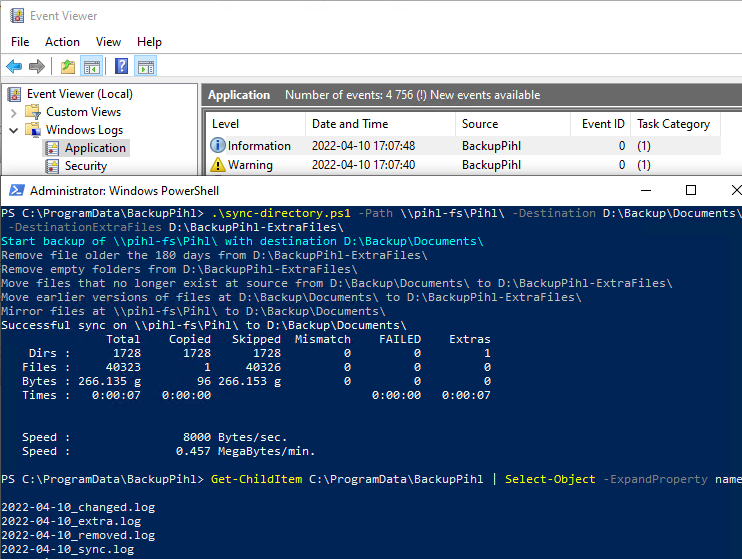

# Backup using robocopy

Sync directorys and put extra/old files in other folder structure.
Extra files older then x days is purged from the "extra" folder.

Uses robocopy

## Functions
- [x] Sync files/shares between computers.
- [x] "old" files on target moved to extra folder
- [x] "old" files removed after x months
- [x] Log Fullname/path - Total size - Total num
  -   [x] New files copied
  -   [x] Old files moved
  -   [x] Old files removed

### Logging
- [x] File dump
- [x] Windows Eventlog
- [x] Console

## Example
```powershell
.\sync-directory.ps1 -Path \\pihl-fs\Pihl\ -Destination D:\Backup\Documents\ -DestinationExtraFiles D:\Backup\BackupPihl-ExtraFiles\ -Verbose
```

### Result


***
## Requires
```powershell
#Requires -RunAsAdministrator
#Requires -Modules Microsoft.PowerShell.Management
```

## Synopsis
```powershell

.SYNOPSIS
    Sync directories and put extra/old files in other folder structure.
    Extra files older then x days is purged from the "extra" folder.

    Uses robocopy
.DESCRIPTION
    Steps;
        1. Removes empty directories and files older then defined days
        2. Moves files on destination not existing on source to another directory
        4. Move earlier versions of files with added date in filename
        3. Syncs files, do not purge extra files.

    Logging to files;
    Date_Old.log
    Date_Extra.log
    Date_Sync.log
    Date_Error.log

.EXAMPLE
    Sync documents on fileserver to External disk D:
    .\sync-directory.ps1 -Path \\pihl-fs\Pihl\ -Destination D:\Backup\Documents\ -DestinationExtraFiles D:\Backup\BackupPihl-ExtraFiles\ -Verbose

.PARAMETER Path
    Source directory

.PARAMETER Destination
    Target directory

.PARAMETER DestinationExtraFiles
    Target directory of file and folders removed from source since previous sync

.PARAMETER PurgeAge
    Age of files before removed from 'extra' folder

.PARAMETER LoggingPath
    Logging directory

.OUTPUTS
    Logs to Eventlog, files and console
.NOTES

    If source path is empty or wrong target all files in destiantion is moved to the 'extra files' directory.
    Requires to be run as administrator for robocopys 'audit' function to work on getting extra files.
    2021-02-08 Version 0.9 Proof of concept with major bug.
    2022-04-10 Version 1.0 Working backup of files.

.LINK
    https://github.com/KlasPihl

```
